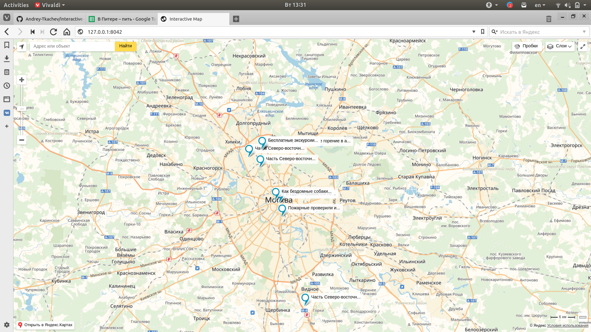

# Interactive Map
## Что это?




Перед вами карта событий Москвы.
Подобное описание смотри на [вики](https://github.com/Andrey-Tkachev/interactive-map/wiki) проекта.

## Как развернуть окружение разработчика?
Процесс развертывания занимает ~15 минут в зависимости от скорости подключения. По сети вам прилетит ~800 мб данных. 

1. Установить *VirtualBox* и *vagrant*.
2. Клонировать репозиторий `git@github.com:Andrey-Tkachev/interactive-map.git`
3. Создайте виртуальную машину с окружением разработчика:
  ```
   cd interactive-map`
   vagrant up
  ```
После этого будет скачан образ Ubunutu 16.04, на её основе развернётся виртуальная машина, в неё поставятся все используемые пакеты и исполняемый файл [tomita-парсера](https://tech.yandex.ru/tomita/).

## Как запускать? 

В папке проекта сказать:
   ```
    vagrant up
    vagrant ssh
   ```
Чтобы наполнить базу данных новостными статьями [tass.ru](http://tass.ru):
   ```
    python manage.py migrate
    python manage.py easy_crawl
    python manage.py populate_models
   ```
Запустить сервер:
   ```
    ./vagrant_conf/run.sh
   ```
  
## Что дальше?

Планы на ближайшее будущее:
* Нужно больше грамматик.
* Научится удалять дубликаты новостей.
* Научится рисовать разные пиктограммы для разных типов новостей.
